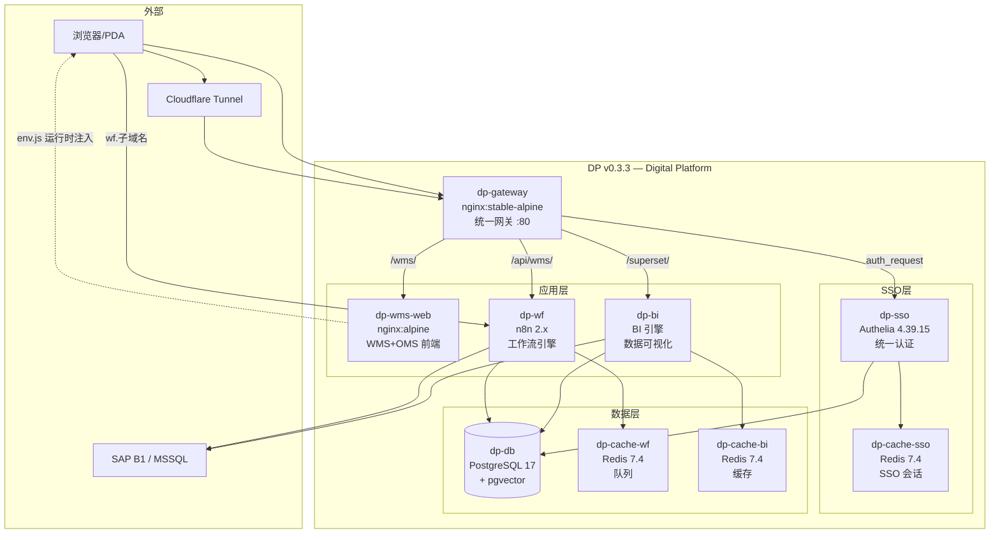

> **注意**: 本仓库为 [foodsaid/dp](https://github.com/foodsaid/dp) 的脱敏快照发布版，仅供参考，不包含 git 历史。

# DP — Digital Platform

> SAP Business One 数字化底座 · WMS + OMS + BI 三位一体 · 统一 PostgreSQL · 多公司一键复制

[](https://github.com/foodsaid/dp/actions/workflows/ci.yml)

## 架构概览



## 快速启动

```bash
# 1. 克隆仓库
git clone https://github.com/foodsaid/dp && cd Digital-Platform

# 2. 创建环境文件
cp .env.example .env
# ⚠️ 必须设置所有密码字段！快速生成: openssl rand -base64 32

# 3. 启动 (推荐，自动检测平台 + 创建网络 + 权限预检)
bash scripts/dev-up.sh

# 4. 访问
# 统一网关:   http://localhost:<DP_GATEWAY_PORT>
# WMS 前端:   http://localhost:<DP_GATEWAY_PORT>/wms/
# n8n 编辑器: http://localhost:<DP_WF_PORT>  (独立端口，不走网关)
```

## 测试

```bash
npm test                   # Jest 单元测试 (WMS + WF 纯函数)
npx playwright test        # E2E 端到端测试
npm run lint               # ESLint 静态分析
pytest tests/infra/        # 基建测试 (BATS + pytest)
```

## 文档

| 文档 | 说明 |
|------|------|
| [CLAUDE.md](CLAUDE.md) | 项目数字大脑 (AI 指南 + 完整架构 + 规则) |
| [docs/DEPLOY-GUIDE.md](docs/DEPLOY-GUIDE.md) | 系统部署实施手册 |
| [docs/WMS-UAT-Guide.md](docs/WMS-UAT-Guide.md) | WMS 用户验收测试指南 |
| [docs/ADR/](docs/ADR/) | 架构决策记录 (8 篇) |
| [.claude/skills/](.claude/skills/) | AI 技能库 (可复用 SOP) |

## 版本路线图

| 版本 | 核心特性 | 状态 |
|------|---------|------|
| **v0.3.3** | 安全加固: CSP/SSL/Redis 安全头, PG 容器间 SSL, CI Node.js 22 | **当前** |
| v0.3.0 | SSO 统一认证: Authelia + nginx auth_request 全站覆盖 | 已发布 |
| v0.2.0 | 可观测性: Prometheus + Grafana + Alertmanager | 已发布 |
| v1.0 | 单实例多公司 (RLS) + API 网关升级 | 计划中 |
| v1.5 | AI 上线 (RAG + pgvector) | 计划中 |

## 许可证

Private @Foodsaid
